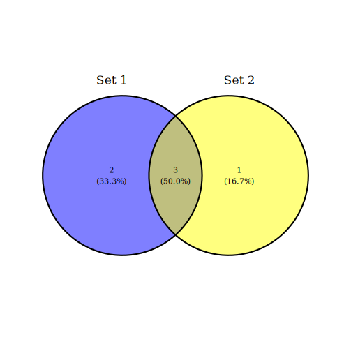
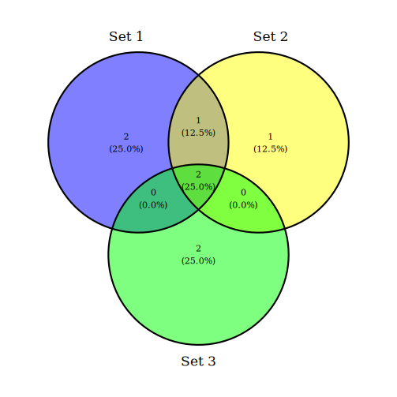

# ggvenn

Venn Diagram by ggplot2. This package is inspired by [Venny](http://bioinfogp.cnb.csic.es/tools/venny/index.html)

## Installation

```{r}
if (!require(devtools)) install.packages("devtools")
devtools::install_github("yanlinlin82/ggvenn")
```

## Usage Example

```{r}
library(ggvenn)

# use list as input
a <- list(`Set 1` = c(1, 3, 5, 7, 9),
          `Set 2` = c(1, 5, 9, 13),
          `Set 3` = c(1, 2, 8, 9),
          `Set 4` = c(6, 7, 10, 12))
ggvenn(a, c("Set 1", "Set 2"))
ggvenn(a, c("Set 1", "Set 2", "Set 3"))
ggvenn(a)

# use data.frame as input
d <- tibble(value   = c(1, 2, 3, 5, 6, 7, 8, 9, 10, 12, 13),
            `Set 1` = c(T, F, T, T, F, T, F, T, F,  F,  F),
            `Set 2` = c(T, F, F, T, F, F, F, T, F,  F,  T),
            `Set 3` = c(T, T, F, F, F, F, T, T, F,  F,  F),
            `Set 4` = c(F, F, F, F, T, T, F, F, T,  T,  F))
ggvenn(d, c("Set 1", "Set 2"))
ggvenn(d, c("Set 1", "Set 2", "Set 3"))
ggvenn(d)

# ggplot gramma
d %>% ggvenn(aes(A = `Set 1`, B = `Set 2`))
d %>% ggvenn(aes(A = `Set 1`, B = `Set 2`, C = `Set 3`))
d %>% ggvenn(aes(A = `Set 1`, B = `Set 2`, C = `Set 3`, D = `Set 4`))
```

## Screenshots






